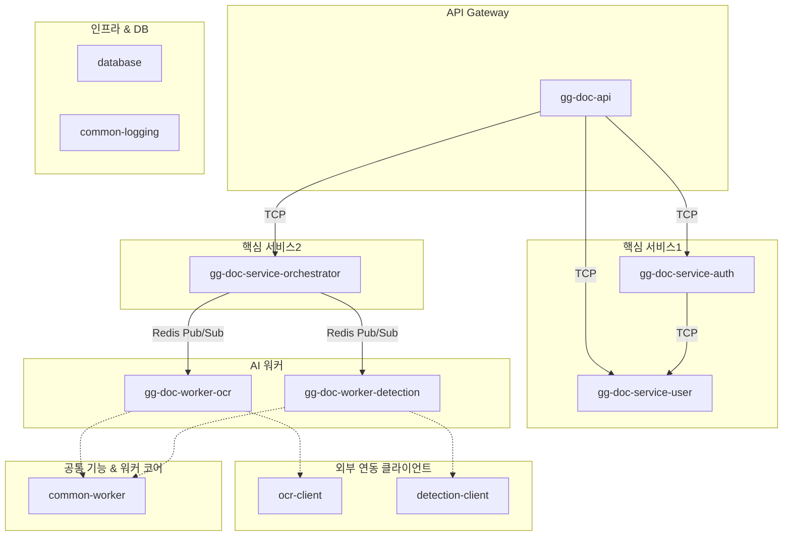

# 모듈 의존 관계 그래프 (Simplified)

- **APP_API**가 **Orchestrator**를 호출하는 흐름을 추가하여 그래프의 균형을 맞췄습니다.
- **라이브러리**를 역할별(클라이언트, 인프라, 코어)로 그룹화했습니다.

```mermaid
graph TD
%% === Applications Grouped by Role ===
    subgraph Gateway [API Gateway]
        API[gg-doc-api]
    end

    subgraph Services1 [핵심 서비스1]
        AuthService[gg-doc-service-auth]
        UserService[gg-doc-service-user]
    end

    subgraph Services2 [핵심 서비스2]
        Orchestrator[gg-doc-service-orchestrator]
    end

    subgraph Workers [AI 워커]
        WorkerOCR[gg-doc-worker-ocr]
        WorkerDet[gg-doc-worker-detection]
    end

%% === Libraries Grouped by Role ===
    subgraph ClientLibs [외부 연동 클라이언트]
        OCRClient[ocr-client]
        DetClient[detection-client]
    end

    subgraph InfraLibs [인프라 & DB]
        DBLib[database]
        SharedLibs[common-logging]
    end

    subgraph CoreLibs [공통 기능 & 워커 코어]
        WorkerLib[common-worker]
    end

%% === Runtime Communication (Service to Service) ===
%% API Connects to Services AND Orchestrator
    API -- TCP --> AuthService
    API -- TCP --> UserService
    API -- TCP --> Orchestrator
%% Service -> Service
    AuthService -- TCP --> UserService
%% Flow -> Workers
    Orchestrator -- Redis Pub/Sub --> WorkerOCR
    Orchestrator -- Redis Pub/Sub --> WorkerDet
%% === Compile-time Dependencies (Code Usage) ===
%% Gateway Deps


%% Worker Deps
    WorkerOCR -.-> WorkerLib & OCRClient
    WorkerDet -.-> WorkerLib & DetClient 
```
